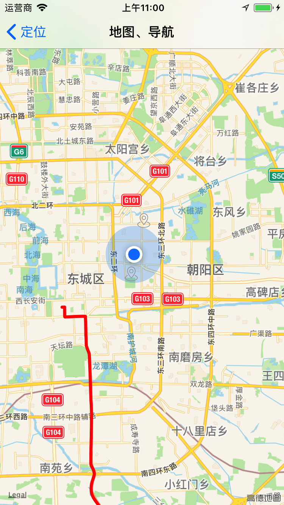

# ASMapKit
### 实现地图定位、导航、地理位置编码转换等小功能的demo，可手动在地图上绘制导航路径或结合系统自带地图进行导航,通过以下两行代码控制
##### //打开系统自带地图导航  
[MKMapItem openMapsWithItems:@[mapItem1,mapItem2] launchOptions:options];     
##### //请求路径信息手动绘制
[self requesrWithItem:mapItem1 andItem2:mapItem2];

#### 地理位置转换效果图，可双向转换

demo中导航功能目的地和所在地是写死两个城市，不过demo中实现了点击地图获取地理位置的方法，有兴趣的小伙伴可以做下参考

#### 定位导航效果图
